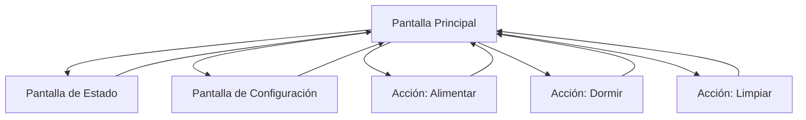

# Documento de Requisitos del Producto - Tama Web

## 1. Descripción General del Producto

Aplicación web que simula una mascota virtual clásico desarrollada con React y Tamagui, featuring una mascota virtual que requiere cuidados constantes en una interfaz retro estilo blanco y negro.

La aplicación utiliza Web Workers para manejar la lógica del juego en segundo plano, asegurando que la mascota continúe evolucionando incluso cuando el usuario no esté interactuando activamente.

## 2. Características Principales

### 2.1 Roles de Usuario

| Rol                 | Método de Registro          | Permisos Principales                                           |
| ------------------- | --------------------------- | -------------------------------------------------------------- |
| Usuario por Defecto | Acceso directo sin registro | Puede cuidar la mascota, usar todos los controles, ver estados |

### 2.2 Módulo de Características

Nuestra aplicación TamaWeb consiste en las siguientes páginas principales:

1. **Pantalla Principal**: pantalla de juego retro, mascota animada, controles de acción, indicadores de estado.
2. **Pantalla de Estado**: vista detallada de estadísticas, historial de cuidados, información de la mascota.
3. **Pantalla de Configuración**: ajustes de sonido, velocidad de animación, controles de teclado personalizables.

### 2.3 Detalles de Páginas

| Nombre de Página       | Nombre del Módulo       | Descripción de Características                                                                                         |
| ---------------------- | ----------------------- | ---------------------------------------------------------------------------------------------------------------------- |
| Pantalla Principal     | Área de Mascota         | Mostrar mascota animada que se mueve aleatoriamente, cambiar sprites según estado emocional y necesidades              |
| Pantalla Principal     | Sistema de Necesidades  | Implementar barras de hambre, sueño, higiene que disminuyen con el tiempo, mostrar alertas visuales cuando están bajas |
| Pantalla Principal     | Controles de Acción     | Botones para alimentar, dormir, limpiar mapeados a teclas específicas (F para comida, S para dormir, C para limpiar)   |
| Pantalla Principal     | Indicadores de Estado   | Lista de iconos que muestran hambre, felicidad, salud, energía, suciedad con estados visuales claros                   |
| Pantalla Principal     | Worker de Juego         | Ejecutar lógica de juego en background usando Web Worker, actualizar estados cada 30 segundos, persistir datos         |
| Pantalla Estado        | Estadísticas Detalladas | Mostrar edad, peso, nivel de felicidad, tiempo total de cuidado, eventos recientes                                     |
| Pantalla Estado        | Historial de Cuidados   | Registrar todas las acciones del usuario con timestamps, mostrar patrones de cuidado                                   |
| Pantalla Configuración | Ajustes de Audio        | Controlar sonidos de la mascota, efectos de botones, volumen general                                                   |
| Pantalla Configuración | Personalización         | Cambiar velocidad de animación, esquemas de color retro, mapeo de teclas personalizable                                |

## 3. Proceso Principal

El usuario accede directamente a la pantalla principal donde ve su mascota virtual moviéndose. La mascota requiere atención constante - cuando tiene hambre, muestra iconos de comida y se ve triste. El usuario presiona 'F' o hace clic en el botón de comida para alimentarla. Similar proceso para sueño ('S') y limpieza ('C'). Los indicadores de estado cambian en tiempo real, y el Web Worker mantiene la lógica corriendo incluso si el usuario cambia de pestaña. El usuario puede navegar a la pantalla de estado para ver estadísticas detalladas o a configuración para personalizar la experiencia.

## 4. Diseño de Interfaz de Usuario

### 4.1 Estilo de Diseño

- **Colores primarios y secundarios**: Escala de grises (#000000, #333333, #666666, #CCCCCC, #FFFFFF) para simular pantalla LCD retro
- **Estilo de botones**: Botones rectangulares con bordes pixelados, efecto de presión visual
- **Fuente y tamaños preferidos**: Fuente monoespaciada tipo 'Courier New' o 'Monaco', tamaños 12px-16px para texto, 8px para detalles
- **Estilo de layout**: Diseño centrado tipo consola portátil, bordes redondeados simulando dispositivo físico
- **Sugerencias de emojis/iconos**: Iconos pixelados 8-bit style: 🍎 para comida, 😴 para sueño, 🧽 para limpieza, ❤️ para salud

### 4.2 Resumen de Diseño de Páginas

| Nombre de Página       | Nombre del Módulo     | Elementos de UI                                                                                           |
| ---------------------- | --------------------- | --------------------------------------------------------------------------------------------------------- |
| Pantalla Principal     | Área de Mascota       | Contenedor 200x150px con fondo gris claro, sprite de mascota 32x32px, animaciones de movimiento suaves    |
| Pantalla Principal     | Controles de Acción   | Tres botones rectangulares 60x40px, texto blanco sobre fondo negro, disposición horizontal                |
| Pantalla Principal     | Indicadores de Estado | Grid 2x3 de iconos 24x24px, barras de progreso horizontales 80x8px, colores de alerta (rojo para crítico) |
| Pantalla Estado        | Estadísticas          | Layout de tabla con fuente monoespaciada, números alineados a la derecha, separadores de línea            |
| Pantalla Configuración | Controles             | Sliders estilo retro, checkboxes cuadrados, labels en mayúsculas                                          |

### 4.3 Responsividad

La aplicación está diseñada desktop-first con adaptación móvil. En dispositivos táctiles, los botones se amplían para facilitar la interacción, y se añaden gestos de swipe para navegación entre pantallas.
